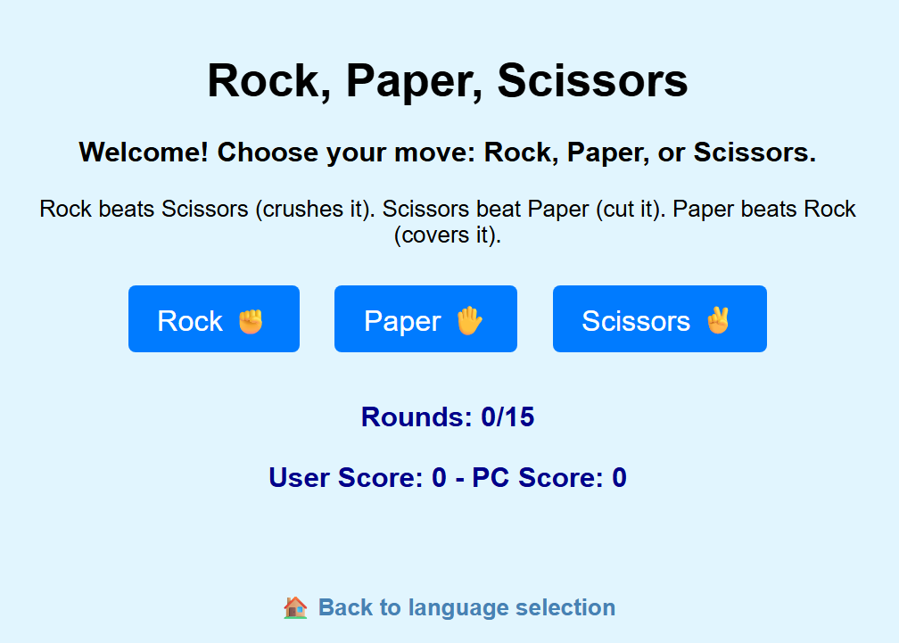

# 🎮 Rock Paper Scissors / Sasso Carta Forbice

**🔗 Play the game here: [Live Demo](https://forren70.github.io/rock-paper-scissors/)**

A bilingual (Italian & English) implementation of the classic game, available as both a **Python console application** and a **Web-based interface**.

## 🚀 Project Overview
This project demonstrates basic programming logic, UI/UX design for web, and multilingual support.

### 🛠 Technologies
- **Python**: Console version with randomized AI logic.
- **HTML5/CSS3**: Responsive web interface with custom styling.
- **JavaScript**: Game engine for the web version.

---

## 🇮🇹 Versione Italiana
Il progetto include una versione web interattiva e uno script Python.
- **Web**: Apri `index.html` e seleziona la lingua.
- **Python**: Esegui `python carta-forbice-sasso.py`.

## 🇬🇧 English Version
The project includes an interactive web version and a Python script.
- **Web**: Open `index.html` and select the language.
- **Python**: Run `python rock-paper-scissors.py`.

---

## 📂 Structure
- `index.html`: Language selector (Landing Page).
- `game_it.html` / `game_en.html`: Web game engines.
- `*.py`: Console versions of the game.
